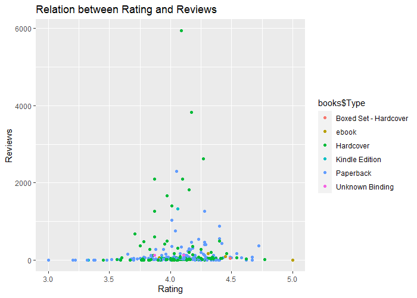

# R-Assignment 4

**Created by Naphat Nuansri (ID: 63130500027)**

Choose Dataset:
1. Top 270 Computer Science / Programing Books (Data from Thomas Konstantin, [Kaggle](https://www.kaggle.com/thomaskonstantin/top-270-rated-computer-science-programing-books)) >> [Using CSV](https://raw.githubusercontent.com/safesit23/INT214-Statistics/main/datasets/prog_book.csv)

### Outlines
1. Explore the dataset
2. Learning function from Tidyverse
3. Transform data with dplyr and finding insight the data
4. Visualization with GGplot2

## Part 1: Explore the dataset

```
# Library
library(readr)
library(dplyr)
library(stringr)
library(ggplot2)

# dataset
books <- read_csv("https://raw.githubusercontent.com/safesit23/INT214-Statistics/main/datasets/prog_book.csv")

# viewdataset
glimpse(books)
View(books)
summary(books)

```

This dataset holds a list of 270 books in the field of computer science and programming related topics.
In this dataset has 270 rows 7 columns( Rating , Reviews , Book title , Description , Number of pages , Type , Price )
| column | Data Type | Description |
| ---- | ---- | ---- |
| Rating | numeric | The user rating for the book. the rating score ranges between 0 and 5.
| Reviews | numeric | The number of reviews found on this book.
| Book_title | character | The name of the book.
| Description | character | a short description of the book.
| Number_Of_Pages | numeric | Number of pages in the book.
| Type | character | The type of the book meaning is it a hardcover book or an ebook or a kindle book etc.
| Price | numeric  | The average price of the book in USD where the average is calculated according the 5 web sources.

```
> glimpse(books)
Rows: 271
Columns: 7
$ Rating          <dbl> 4.17, 4.01, 3.33, 3.97, 4.06, 3.84, 4.09, 4.15, 3.87, 4.62, 4.03, 3.78, 3.73, 3.87, 3.87, ~
$ Reviews         <dbl> 3829, 1406, 0, 1658, 1325, 117, 5938, 1817, 2093, 0, 160, 481, 33, 1255, 593, 417, 80, 279, ~
$ Book_title      <chr> "The Elements of Style", "The Information: A History, a Theory, a Flood", "Responsive Web ~
$ Description     <chr> "This style manual offers practical advice on improving writing skills. Throughout, the  ~
$ Number_Of_Pages <dbl> 105, 527, 50, 393, 305, 288, 256, 368, 259, 128, 352, 352, 200, 328, 240, 288, 392, 304, ~
$ Type            <chr> "Hardcover", "Hardcover", "Kindle Edition", "Hardcover", "Kindle Edition", "Paperback", ~
$ Price           <dbl> 9.323529, 11.000000, 11.267647, 12.873529, 13.164706, 14.188235, 14.232353, 14.364706, ~
```

```
> summary(books)
     Rating         Reviews        Book_title        Description        Number_Of_Pages      Type               Price        
 Min.   :3.000   Min.   :   0.0   Length:271         Length:271         Min.   :  50.0   Length:271         Min.   :  9.324  
 1st Qu.:3.915   1st Qu.:   5.5   Class :character   Class :character   1st Qu.: 289.0   Class :character   1st Qu.: 30.751  
 Median :4.100   Median :  35.0   Mode  :character   Mode  :character   Median : 384.0   Mode  :character   Median : 46.318  
 Mean   :4.067   Mean   : 185.6                                         Mean   : 475.1                      Mean   : 54.542  
 3rd Qu.:4.250   3rd Qu.: 116.5                                         3rd Qu.: 572.5                      3rd Qu.: 67.854  
 Max.   :5.000   Max.   :5938.0                                         Max.   :3168.0                      Max.   :235.650  
```

## Part 2: Learning function from Tidyverse

- Function `filter()` from package [dplyr](https://dplyr.tidyverse.org/reference/filter.html). It using for select columns

```
books %>% filter(Reviews > 2000,na.rm = TRUE)
```


## Part 3: Transform data with dplyr and finding insight the data

### 1. แสดงชื่อหนังสือประเภท ebook โดยเรียงจาก rating มากไปน้อย

```
books %>% select(Rating,Book_title) %>% filter(books$Type == "ebook" ,na.rm = TRUE) %>% arrange(desc(Rating))
```

Result:

```
Rating Book_title                                     
   <dbl> <chr>                                          
1   5    Your First App: Node.js                        
2   4.45 Deep Learning                                  
3   4.31 Learn You a Haskell for Great Good!            
4   4.16 Algorithms Unlocked                            
5   4.15 From Mathematics to Generic Programming        
6   4.02 Practical Foundations for Programming Languages
7   3.91 Effective Programming: More Than Writing Code  
```

Explain :
- select() เลือกว่าจะนำคอลัมน์ไหนบ้างมาแสดง : เลือก column Rating กับ Book_title
- filter() ใช้ใส่เงื่อนไขข้อมูลที่จะเลือก : เป็นหนังสือประเภท ebook
- arrange() ใช้จัดเรียงลำดับข้อมูล : ให้เรียงตาม Rating
- desc() ให้ข้อมูลเรียงจากมากไปน้อย : ให้เรียงตาม Rating จากมากไปน้อย


### 2. แสดงชื่อหนังสือที่ราคาอยู่ระหว่าง 10-20 USD

```
books %>% select(Book_title,Price) %>% filter(between(Price,10,20)) 
```

Result:

```
   Book_title                                                                             Price
   <chr>                                                                                  <dbl>
 1 The Information: A History, a Theory, a Flood                                           11  
 2 Responsive Web Design Overview For Beginners                                            11.3
 3 Ghost in the Wires: My Adventures as the World's Most Wanted Hacker                     12.9
 4 How Google Works                                                                        13.2
 5 The Meme Machine                                                                        14.2
 6 Start with Why: How Great Leaders Inspire Everyone to Take Action                       14.2
 7 Algorithms to Live By: The Computer Science of Human Decisions                          14.4
 8 Weapons of Math Destruction: How Big Data Increases Inequality and Threatens Democracy  14.5
 9 ZX Spectrum Games Code Club: Twenty fun games to code and learn                         14.6
10 Sync: The Emerging Science of Spontaneous Order                                         15.2
# ... with 16 more row
```

Explain :
- select() เลือกว่าจะนำคอลัมน์ไหนบ้างมาแสดง : เลือก column Book_title และ Price
- filter() ใช้ใส่เงื่อนไขข้อมูลที่จะเลือก : หนังสือที่ราคาอยู่ระหว่าง 10-20 USD
- between() ใช้กำหนดว่าจะค่าในคอมลัมน์ไหน ในช่วงใด : เลือกคอลัมน์ Price ที่อยู่ระหว่าง 10-20 ( x=Price ,left=10 ,right=20 )


### 3. แสดงประเภทของหนังสือและจำนวนหนังสือของแต่ละประเภท
```
books %>% group_by(Type) %>% count() %>% rename(Total = n)
```

Result:

```
  Type                  Total
  <chr>                 <int>
1 Boxed Set - Hardcover     1
2 ebook                     7
3 Hardcover                95
4 Kindle Edition           10
5 Paperback               156
6 Unknown Binding           2

```

Explain :
- group_by() จัดกลุ่มตามคอลัมน์ที่เราใส่ค่า : จัดกลุ่ม Tpye ของหนังสือ
- count() ใช้นับจำนวนข้อมูลแต่ละประเภทที่ group_by() : จำนวนของหนังสือแต่ละประเภทว่ามีทั้งหมดกี่จำนวน
- rename() ใช้เปลี่ยนชื่อคอลัมน์ : เปลี่ยนชื่อจากชื่อคอลัมน์ n เป็น Total 

### 4. 10 อันดับหนังสือที่มียอดเขียนรีวิวมากที่สุด

```
books %>% select(Book_title,Reviews) %>% arrange(desc(books$Reviews)) %>% head(n = 10L)
```

Result:

```
   Book_title                                                                                Reviews
   <chr>                                                                                       <dbl>
 1 Start with Why: How Great Leaders Inspire Everyone to Take Action                            5938
 2 The Elements of Style                                                                        3829
 3 The Phoenix Project: A Novel About IT, DevOps, and Helping Your Business Win                 2629
 4 The Goal: A Process of Ongoing Improvement                                                   2290
 5 Weapons of Math Destruction: How Big Data Increases Inequality and Threatens Democracy       2093
 6 The Innovators: How a Group of Hackers, Geniuses and Geeks Created the Digital Revolution    2092
 7 Algorithms to Live By: The Computer Science of Human Decisions                               1817
 8 Ghost in the Wires: My Adventures as the World's Most Wanted Hacker                          1658
 9 The Information: A History, a Theory, a Flood                                                1406
10 How Google Works                                                                             1325
```
Explain :
- select() เลือกว่าจะนำคอลัมน์ไหนบ้างมาแสดง : เลือก column Reviews ,Book_title และ Rating
- arrage(desc()) เรียงลำดับข้อมูลจากมากไปน้อย : เรียงลำดับด้วย Reviews จากมากไปน้อย
- head() เลือกกี่อันดับแรกของข้อมูลทั้งหมด : head(n = 10L) เลือกข้อมูลแค่ 10 ลำดับแรก


### 5. แสดงหนังสือที่มียอด rating มากที่สุดและน้อยที่สุด

```
#Max Rating
books %>% select(Book_title,Rating) %>%filter(books$Rating == max(Rating))

#Min Rating
books %>% select(Book_title,Rating) %>%filter(books$Rating == min(Rating))
```

Result:

```
#Max Rating
  Book_title              Rating
  <chr>                    <dbl>
1 Your First App: Node.js      5

#Min Rating
  Book_title                                                                                Rating
  <chr>                                                                                      <dbl>
1 Advanced Game Programming: A Gamedev.Net Collection                                            3
2 Cross-Platform Game Programming (Game Development) (Charles River Media Game Development)      3
3 Lambda-Calculus, Combinators and Functional Programming                                        3
```

Explain :
- select() เลือกว่าจะนำคอลัมน์ไหนบ้างมาแสดง : เลือก Book_title และ Rating
- filter() กำหนดเงื่อนไขในการเลือกข้อมูล : เลือกหนังสือที่มี rating มากสุด และ rating น้อยสุด
- max() หาค่าที่มากที่สุด : max(Rating) หาค่า rating ที่มากที่สุด
- min() หาค่าที่น้อยที่สุด : min(Rating) หาค่า rating ที่น้อยที่สุด

### 6. แสดงหนังสือที่มี rating มากกว่าค่าเฉลี่ยและมีจำนวนหน้ามากกว่า 500 หน้า
```
mean(books$Rating)
books %>% select(Book_title,Rating,Number_Of_Pages) %>%filter(books$Rating > mean(books$Rating),books$Number_Of_Pages > 500)
```

Result:

```
> mean(books$Rating)
[1] 4.067417

> books %>% select(Book_title,Rating,Number_Of_Pages) %>%filter(books$Rating > mean(Rating),books$Number_Of_Pages > 500)
   Book_title                                                                                               Rating Number_Of_Pages
   <chr>                                                                                                     <dbl>           <dbl>
 1 The Innovators: How a Group of Hackers, Geniuses and Geeks Created the Digital Revolution                  4.1              542
 2 Python Crash Course: A Hands-On, Project-Based Introduction to Programming                                 4.35             560
 3 CSS: The Missing Manual                                                                                    4.11             560
 4 Reviewing C++                                                                                              4.2              546
 5 Code Complete                                                                                              4.29             914
 6 C# in Depth                                                                                                4.5              554
 7 Designing Data-Intensive Applications: The Big Ideas Behind Reliable, Scalable, and Maintainable Systems   4.72             616
 8 The Linux Programming Interface: A Linux and Unix System Programming Handbook                              4.62            1506
 9 Head First Design Patterns                                                                                 4.28             638
10 Reviewing Java                                                                                             4.25             658
# ... with 36 more rows
```

Explain :
- select() เลือกว่าจะนำคอลัมน์ไหนบ้างมาแสดง : เลือก Book_title , Rating และ Number_Of_Pages
- filter() กำหนดเงื่อนไขในการเลือกข้อมูล : เลือกหนังสือที่มี Rating มากกว่าค่าเฉลี่ย และมี Number_Of_Pages มากกว่า 500 หน้า
- mean() หาค่าเฉลี่ย : mean(Rating) หาค่าเฉลี่ยของ Rating


## Part 4: Visualization with GGplot2
### 1.) Graph show relation between height and mass
```
scat_plot <- starwars %>% filter(mass<500) %>% ggplot(aes(x=height,y=mass))+
  geom_point(aes(color=gender))

scat_plot+geom_smooth()
```
Result:



**Guideline:
Embed Image by using this syntax in markdown file
````

````
