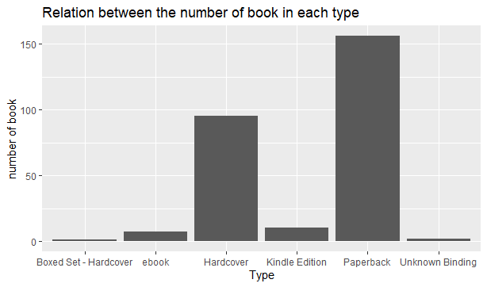

# Assignment 4 (Individual 5%): Data Visualization
create by Panista Rienthong 63130500076
## Instruction

- This assignment is Individual Assignment. It divided into Part A and Part B
- Total Score is 20 Pts (See criteria in LEB2)
- Due date: Sec A - 25 Oct 2021 At 23:00 GMT+7 / Sec B - 29 Oct 2021 At 23:00 GMT+7
- Create folder HW04_studentId in Group repository and push all code (R, md or Rmd) in this repository.
- Send in format: [PDF file](https://github.com/safesit23/INT214-Statistics/blob/main/assignment/HW04_SamplePdf.pdf) in LEB2 (ส่งงานเป็นไฟล์ PDF ใน LEB2 โดยให้แปะลิงก์งานที่ทำ Part A สำหรับเข้าถึงไฟล์ต่าง ๆ ใน git และ Part B ที่ทำ Dashboard) 
 
## Dataset:

1. Top 270 Computer Science / Programing Books (Data from Thomas Konstantin, [Kaggle](https://www.kaggle.com/thomaskonstantin/top-270-rated-computer-science-programing-books)) >> [Using CSV](https://raw.githubusercontent.com/safesit23/INT214-Statistics/main/datasets/prog_book.csv)

## Part A: Finding Insight the data in R

- Goal: Can find insight the data and visualize the data.
- Score: 13 Pts

### Outlines

1. Explore the dataset
2. Learning function from Tidyverse
3. Transform data with dplyr and finding insight the data
4. Visualization with GGplot2

## Part 1 : Explore the dataset
```
# Library
library(dplyr)
library(stringr)
library(readr)
library(ggplot2)

# dataset
book <- read_csv("https://raw.githubusercontent.com/safesit23/INT214-Statistics/main/datasets/prog_book.csv")

# viewdataset
glimpse(book)
summary(book)

```
##### Result :
```
> glimpse(book)
Rows: 271
Columns: 7
$ Rating          <dbl> 4.17, 4.01, 3.33, 3.97, 4.06, 3.84, 4.09, 4.15, 3.87, 4.62, 4.03~
$ Reviews         <dbl> 3829, 1406, 0, 1658, 1325, 117, 5938, 1817, 2093, 0, 160, 481, 3~
$ Book_title      <chr> "The Elements of Style", "The Information: A History, a Theory, ~
$ Description     <chr> "This style manual offers practical advice on improving writing ~
$ Number_Of_Pages <dbl> 105, 527, 50, 393, 305, 288, 256, 368, 259, 128, 352, 352, 200, ~
$ Type            <chr> "Hardcover", "Hardcover", "Kindle Edition", "Hardcover", "Kindle~
$ Price           <dbl> 9.323529, 11.000000, 11.267647, 12.873529, 13.164706, 14.188235,~
```
```
> summary(book)
     Rating         Reviews        Book_title       
 Min.   :3.000   Min.   :   0.0   Length:271        
 1st Qu.:3.915   1st Qu.:   5.5   Class :character  
 Median :4.100   Median :  35.0   Mode  :character  
 Mean   :4.067   Mean   : 185.6                     
 3rd Qu.:4.250   3rd Qu.: 116.5                     
 Max.   :5.000   Max.   :5938.0                     
 Description        Number_Of_Pages      Type          
 Length:271         Min.   :  50.0   Length:271        
 Class :character   1st Qu.: 289.0   Class :character  
 Mode  :character   Median : 384.0   Mode  :character  
                    Mean   : 475.1                     
                    3rd Qu.: 572.5                     
                    Max.   :3168.0                     
     Price        
 Min.   :  9.324  
 1st Qu.: 30.751  
 Median : 46.318  
 Mean   : 54.542  
 3rd Qu.: 67.854  
 Max.   :235.650  
 ```
 
| No | columns | type | explanation |
| :---- | :---- | :---- | :---- |
| 1 | Rating | numeric | แสดงข้อมูลว่าผู้ใช้ให้คะแนนหนังสือเท่าไหร่ คะแนนเรตติ้งอยู่ระหว่าง 0 ถึง 5 |
| 2 | Reviews | numeric | แสดงจำนวนบทวิจารณ์ที่พบในหนังสือเล่มนี้ |
| 3 | Book_title | character | ชื่อหนังสือ |
| 4 | Description | character | คำอธิบายสั้น ๆ ของหนังสือ |
| 5 | Number_Of_Pages | numeric | แสดงจำนวนหน้าในหนังสือแต่ละเล่ม |
| 6 | Type | character | แสดงประเภทของหนังสือ เช่น หนังสือปกแข็ง หรือ ebook หรือ Kindle book เป็นต้น |
| 7 | Price | numeric | แสดงราคาเฉลี่ยของหนังสือในสกุลเงิน USD ซึ่งค่าเฉลี่ยคำนวณตามแหล่งที่มาของเว็บทั้ง 5 แห่ง |
 

___
## Part 2 : Learning function from Tidyverse
- Function `arrange()` from package [dplyr](https://dplyr.tidyverse.org/reference/arrange.html)). It using for select columns

```
book %>% arrange(Rating)
```
Explain 
- arrange() เป็น function ที่ใช้ในการเรียงข้อมูลจากน้อยไปมาก หรือ มากไปน้อย 
- desc คือ เรียงจากมากไปน้อย 
- แต่ถ้าเรียงจากน้อยไปมากก็ไม่จำเป็นต้องใส่เงื่อนไขอะไร เพราะ default จะเป็นค่าที่เรียงจากน้อยไปมากอยู่แล้ว

---
<br>
## Part 3 : Transform data with dplyr and finding insight the data

 1. แสดงหนังสือที่มีจำนวนหน้ามากที่สุด 3 อันดับแรก

```
book %>% select(Book_title,Number_Of_Pages) %>% arrange(desc(Number_Of_Pages)) %>% head(n = 3L)
```

Result

```
  Book_title                                                         Number_Of_Pages
  <chr>                                                                        <dbl>
1 The Art of Computer Programming, Volumes 1-4a Boxed Set                       3168
2 The Linux Programming Interface: A Linux and Unix System Programm~            1506
3 Numerical Recipes: The Art of Scientific Computing                            1235

```

Explain 
- select เลือกข้อมูลเฉพาะ column (Book_title,Number_Of_Pages)
- arrange ในที่นี้ใช้ desc เพื่อใช้เรียงข้อมูลจำนวนหน้าที่มากที่สุด
- head ใช้แสดงข้อมูล 3 แถวแรก

---
<br>
2.แสดงหนังสือที่มีจำนวนหน้าน้อยที่สุด 7 อันดับแรก

```
book %>% select(Book_title,Number_Of_Pages) %>% arrange(Number_Of_Pages) %>% head(n = 7L)
```

Result

```
Book_title                                                      Number_Of_Pages
  <chr>                                                                     <dbl>
1 Responsive Web Design Overview For Beginners                                 50
2 The Elements of Style                                                       105
3 The Principles of Object-Oriented JavaScript                                120
4 ZX Spectrum Games Code Club: Twenty fun games to code and learn             128
5 Scrum and XP from the Trenches                                              140
6 JavaScript: The Good Parts                                                  153
7 Think Complexity: Complexity Science and Computational Modeling             160

```

Explain 
- select เลือกข้อมูลเฉพาะ column (Book_title,Number_Of_Pages)
- arrange เพื่อใช้เรียงข้อมูลจำนวนหน้าที่น้อยที่สุด
- head ใช้แสดงข้อมูล 7 แถวแรก


3.แสดงหนังสือที่มีเรตติ้งมากที่สุด
```
book %>% select(Book_title,Rating) %>% filter(book$Rating == max(Rating))
```
Result:
```
Book_title              Rating
  <chr>                    <dbl>
1 Your First App: Node.js      5
```
Explain
- ใช้ filter เพื่อหาเรตติ้งที่มากที่สุด
- ใช้ select แสดงชื่อหนังสือและเรตติ้ง
4. แสดงชื่อหนัง และประเภทที่มีคนรีวิวเยอะที่สุด
```
book %>% select(Book_title,Type,Reviews) %>% arrange(desc(Reviews)) %>% head(n = 1L)

```
Result:
```
 Book_title                                                        Type      Reviews
  <chr>                                                             <chr>       <dbl>
1 Start with Why: How Great Leaders Inspire Everyone to Take Action Hardcover    5938
```
Explain
- select เลือกข้อมูลเฉพาะ column (Book_title,Type,Reviews)
- arrange ในที่นี้ใช้ desc เพื่อใช้ข้อมูลจำนวนรีวิวที่มากที่สุด

5.แสดงชื่อหนังสือที่มีเรตติ้งมากกว่า 4
```
book %>% filter(Rating > 4) %>% select(Book_title)
```
Result:
```
 Book_title                                                                       
   <chr>                                                                            
 1 The Elements of Style                                                            
 2 The Information: A History, a Theory, a Flood                                    
 3 How Google Works                                                                 
 4 Start with Why: How Great Leaders Inspire Everyone to Take Action                
 5 Algorithms to Live By: The Computer Science of Human Decisions                   
 6 ZX Spectrum Games Code Club: Twenty fun games to code and learn                  
 7 Sync: The Emerging Science of Spontaneous Order                                  
 8 The Innovators: How a Group of Hackers, Geniuses and Geeks Created the Digital R~
 9 Debugging: The 9 Indispensable Rules for Finding Even the Most Elusive Software ~
10 Help Your Kids with Computer Coding                                              
# ... with 162 more rows
```
Explain
-  select เลือกข้อมูลเฉพาะ column (Book_title)
- ใช้ filter เลือกชื่อหนังสือที่มีข้อมูลมากกว่า 4

6.หาหนังสือแต่ละประเภทมีจำนวนเท่าไหร่
```
table(book$Type)
```
Result:
```
Boxed Set - Hardcover                 ebook             Hardcover 
                    1                     7                    95 
       Kindle Edition             Paperback       Unknown Binding 
                   10                   156                     2 
```
Explain
- ใช้ table สร้างตารางเก็บข้อมูลว่าหนังสือแต่ละประเภทมีจำนวนกี่เล่ม

## Part 4 : Visualization with GGplot2

__1. The graph depicts Price and Number of pages relationship__
```
pg <- book %>% ggplot(aes(x=Price, y=Number_Of_Pages)) + geom_point(aes(color=Type)) + ggtitle("Price and Number of pages relationship")
pg
```
#### Result :


#### Explain :
* กราฟนี้แสดงราคาและจำนวนหน้าของหนังสือ
  * ggtitle ใช้ระบุหัวข้อของกราฟ
  * geom_point(aes(color=Type)) ให้จุดเปลี่ยนสีตามข้อมูล


__2. The graph depicting the Relation between the number of book in each type.__

```
gg<- ggplot(book,aes(x=Type)) + geom_bar()
gg
gg + ggtitle("Relation between the number of book in each type") + xlab("Type") + ylab("number of book")
```
#### Result :



#### Explain :
* กราฟนี้แสดงจำนวนหนังสือในแต่ละประเภท
  * ggtitle ใช้ระบุหัวข้อของกราฟ
  * geom_bar ให้เป็นกราฟแท่ง
  * xlab("Type") + ylab("number of book") คือการระบุชื่อให้ แกน x และ แกน y
